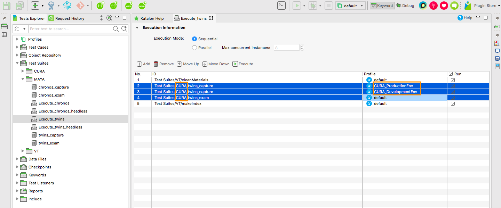

Getting started with custom Visual Testing
===========================================

author: kazurayam

In this article I will explain how develop a screenshot-comparison testing
against an Application-Under-Test you choose.

Here I assume you have read the following articles.
1. [README of Gradle Plugin com.github.kazurayam.visualtestinginks](https://github.com/kazurayam/visualtestinginks-gradle-plugin)
2. [User Guide of visualtestinginks](https://github.com/kazurayam/visualtestinginks-gradle-plugin/blob/master/docs/userguide.md)

I assume you have created a new Katalon Studio project. Of course, you can
name it, but here I assume the project is called `TheProject`.

I assume that you have imported `vt-components-X.X.X.zip` and `vt-example-X.X.X.zip` into `ThePoject`.

## Define a symbol of your target application

When you start developing custom Visual Testing in Katalon Studio, the 1st thing you should do is to define a short name which identifies
your target AUT. The example uses `CURA`. So what would you call your test? Any name you like. I would recommend the symbol to be short to make the codes readable.

Just in the following description, let me assume here you selected `MAYA`.

## Copy CURA resources to make the base of MAYA

As [User Guide of visualtestinginks](https://github.com/kazurayam/visualtestinginks-gradle-plugin/blob/master/docs/userguide.md) described, you should have got a set of Katalon Studio resources named `CURA`.
Now you want to copy them and rename them with new name `MAYA`.

.
├── Object Repository
│   └── MAYA
│       ├── Page_Appointment
│       │   ├── button_Book Appointment.rs
│       │   ├── h2_Make Appointment.rs
│       │   ├── input_hospital_readmission.rs
│       │   ├── input_programs.rs
│       │   ├── input_visit_date.rs
│       │   ├── select_Tokyo CURA Healthcare C.rs
│       │   └── textarea_comment.rs
│       ├── Page_AppointmentConfirmation
│       │   ├── a_Go to Homepage.rs
│       │   ├── p_comment.rs
│       │   ├── p_facility.rs
│       │   ├── p_hospital_readmission.rs
│       │   ├── p_program.rs
│       │   └── p_visit_date.rs
│       ├── Page_Homepage
│       │   └── a_Make Appointment.rs
│       └── Page_Login
│           ├── button_Login.rs
│           ├── input_password.rs
│           └── input_username.rs
├── Profiles
│   ├── MAYA_DevelopmentEnv.glbl
│   ├── MAYA_ProductionEnv.glbl
|
├── Scripts
│   ├── MAYA
│       ├── ImageDiff_chronos
│       ├── ImageDiff_twins
│       ├── Login
│       ├── restorePrevisousScreenshots
│       └── visitSite
├── Test Cases
│   ├── MAYA
│       ├── ImageDiff_chronos.tc
│       ├── ImageDiff_twins.tc
│       ├── Login.tc
│       ├── restorePrevisousScreenshots.tc
│       └── visitSite.tc
├── Test Suites
│   ├── MAYA
│       ├── Execute_chronos.ts
│       ├── Execute_chronos_headless.ts
│       ├── Execute_twins.ts
│       ├── Execute_twins_headless.ts
│       ├── chronos_capture.groovy
│       ├── chronos_capture.ts
│       ├── chronos_exam.groovy
│       ├── chronos_exam.ts
│       ├── twins_capture.groovy
│       ├── twins_capture.ts
│       ├── twins_exam.groovy
│       └── twins_exam.ts
├── vt-run-MAYA-chronos.bat
├── vt-run-MAYA-chronos.sh
├── vt-run-MAYA-twins.bat
└── vt-run-MAYA-twins.sh


## Modify codes to target your AUT

1. In the `Test Suites/MAYA` folder, there are few resources that need to be changed. For example `Test Suites/MAPA/Execute_twins` still has the definition refering to `CURA` components: 
Please edit the definition so that refer to `CURA` -> `MAYA` resources. The following resources needs to be edited similarly.
  1. `Test Suites/MAYA/chronos_capture`
  2. `Test Suites/MAYA/chronos_exam`
  3. `Test Suites/MAYA/Execute_chronos`
  4. `Test Suites/MAYA/Execute_chronos_headless`
  5. `Test Suites/MAYA/Execute_twins`
  6. `Test Suites/MAYA/Execute_twins_headless`
  7. `Test Suites/MAYA/twins_capture`
  8. `Test Suites/MAYA/twins_exam`
2. In the `Test Cases/MAYA` folder, there are some resources that need to be corrected: `CURA` -> `MAYA`.
  1. `Test Cases/MAYA/ImageDiff_chronos`
  ```
  String TESTSUITE_ID = 'CURA/chronos_capture' // should be changed to 'MAYA_chronos_capture'
  ```
  2. `Test Cases/MAYA/ImageDiff_twins`
  ```
  String TESTSUITE_ID = 'CURA/twins_capture' // -> 'MAYA/twins_capture'
  ```
3. The core part of cutomization is `Test Cases/MAYA/visiteSite`. This script visits
you AUT and take screenshots. You should rewrite this script completely. and 99% of
your customization should be on this script.
4. You would want to renew the `Object Repository` as you want. Just do it.

## Essential part of taking screenshot

The [`Test Cases/CURA/visitSite`](../Scripts/CURA/visitSite/Script1554796633484.groovy) has following lines. This is the core part of taking screenshot and saving it into files.

```
import com.kazurayam.materials.MaterialRepository
import com.kazurayam.visualtesting.ManagedGlobalVariable as MGV

...

MaterialRepository mr = (MaterialRepository)GlobalVariable[MGV.MATERIAL_REPOSITORY.getName()]

...

Path png3 = mr.resolveScreenshotPathByURLPathComponents(
					GlobalVariable[MGV.CURRENT_TESTCASE_ID.getName()],
					new URL(WebUI.getUrl()),
					0)
CustomKeywords.'com.kazurayam.ksbackyard.ScreenshotDriver.takeEntirePage'(driver, png3.toFile(), 500)

```

In the above code, the`MaterialRepository mr = ...` portion would look mysterious. In fact, here is hidden a magic. But you can read the source code at `Test Listeners/VTListener` and `Keywords/com/kazurayam/visualtesting/VisualTestingListenerImpl`. If you want to dig into them, please do.

Once executed, this script creates a file at
- `<projectDir>/Materials/CURA.twins_capture/yyyyMMdd_hhmmss/CURA.visitSite/appointment.php%23summary.png`

As you can see, `mr.resolveScreenshotPathByURLPathComoponents()` call determines the file path. How is it done?

`<projectDir>/Materials/` portion is fixed.

The directory name `CURA.twins_capture` is derived from the Test Suite name `CURA/twins_capture`.

The directory name `yyyyMMdd_hhmmss` is derived from the timestamp when the Test Suite was executed.

The directory name `CURA.visitSite` is derived from the Test Case name `CURA/visitSite`.

Finally the file name `appointment.php%23summary.png` is derived from the page URL `https://katalon-demo-cura.herokuapp.com/#appointment`.

## Methods to resolve file name provided by MaterialRepository

The API doc of the `Materials` library is available here: https://kazurayam.github.io/Materials/api/com/kazurayam/materials/MaterialRepository.html

Please check the sample codes of the following `resolveXXX` methods of `com.kazurayam.material.MaterialRepository` interface:

1. [resolveScreenshotPathByURLPathComponents](https://kazurayam.github.io/Materials/api/com/kazurayam/materials/MaterialRepository.html#resolveScreenshotPathByURLPathComponents%28java.lang.String,%20java.net.URL,%20int,%20java.lang.String%29) --- primary candidate to use
2. [resolveScreeshotPath](https://kazurayam.github.io/Materials/api/com/kazurayam/materials/MaterialRepository.html#resolveScreenshotPath%28java.lang.String,%20java.net.URL%29)
3. [resolveMaterialPath](https://kazurayam.github.io/Materials/api/com/kazurayam/materials/MaterialRepository.html#resolveMaterialPath%28java.lang.String,%20java.lang.String,%20java.lang.String%29) --- if you prefer names independent from URL string
